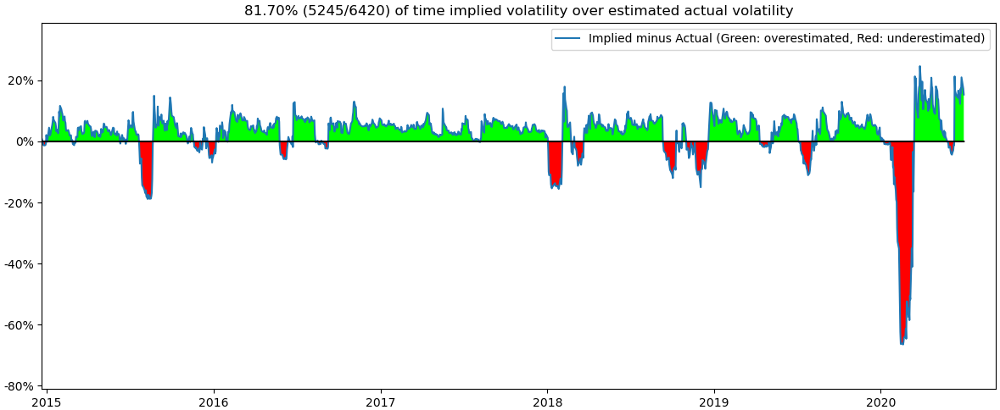

 (Jupyter Notebook)  

 (Jupyter Lab)

---
# Implied Volatility vs Actual Volatility
### [AppleDaily20200810](https://hk.appledaily.com/finance/20200810/YOOTUE4GGFGLVGYXBQIYZJOCYQ/)

#### Implied Volatility vs Actual Volatility (21 business days)
")

#### How much Implied Volatility over estimated Actual Volatility
